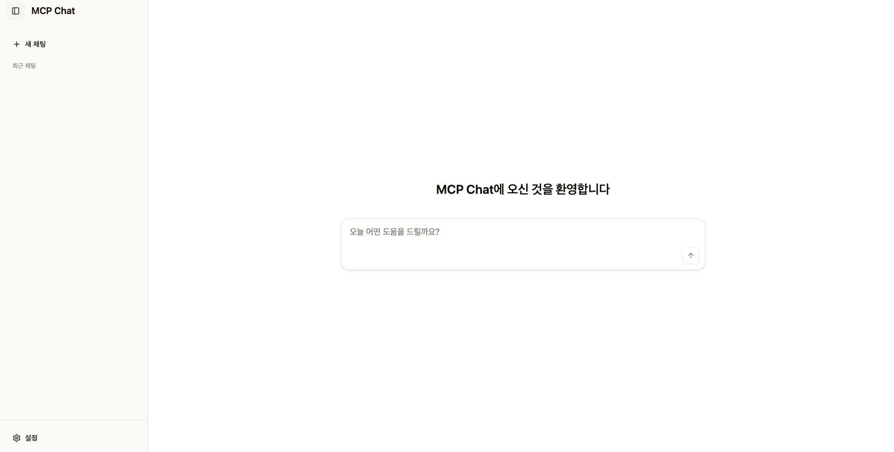

<h2 align="center">
PACE MCP Client
</h2>
<div align="center">
  
  
  
  
  
</div>


<div align="center">
  
</div>


## Overview
**PACE MCP Client**는 AWS Bedrock의 LLM 모델과 MCP(Model Context Protocol) 도구를 통합한 AI 에이전트 플랫폼입니다. Next.js Server Actions 기반으로 구현되어 별도의 백엔드 없이 동작하는 풀스택 웹 애플리케이션입니다.

### 주요 특징
- **Server Actions 기반**: 별도의 백엔드 없이 Next.js만으로 전체 기능 구현
- **MCP 도구 통합**: 다양한 MCP 도구를 자연어로 활용
- **AWS Bedrock 통합**: Amazon Nova, Anthropic Claude 등 다양한 LLM 모델 지원
- **실시간 스트리밍**: ReadableStream을 통한 실시간 응답 스트리밍

### 주요 기능
- **AI 에이전트 챗봇**: 자연어로 MCP 도구를 호출하고 결과를 확인하는 대화형 인터페이스
- **MCP 도구 관리**: 도구 추가/삭제, 상태 모니터링, 실시간 동기화
- **시스템 프롬프트 관리**: AI 에이전트 동작 커스터마이징을 위한 프롬프트 편집기
- **모델 선택**: AWS Bedrock의 다양한 LLM 모델 선택 및 전환
- **파일 업로드**: 챗봇 대화에 파일 첨부 기능
- **사용자 설정**: 개인화된 설정 저장 및 관리

---

## 기술 스택

- **Framework**: Next.js 15.3 (App Router)
- **Language**: TypeScript
- **Styling**: Tailwind CSS + shadcn/ui
- **State Management**: React Context + Server Actions
- **AI Integration**: AWS Bedrock SDK
- **Storage**: Local file system (via settings.ts)
- **Deployment**: Docker + Kubernetes

---

## 프로젝트 구조

```
pace-mcp-client/
├── src/
│   ├── app/                    # Next.js App Router
│   │   ├── actions/           # Server Actions
│   │   │   ├── chat.ts       # 채팅 관련 액션
│   │   │   ├── mcp-tools.ts  # MCP 도구 관리
│   │   │   ├── prompts.ts    # 프롬프트 관리
│   │   │   └── models/       # 모델 관리
│   │   ├── api/              # API 엔드포인트 (레거시, 제거 예정)
│   │   └── page.tsx          # 메인 페이지
│   ├── components/           # React 컴포넌트
│   │   ├── common/          # 공통 컴포넌트
│   │   │   ├── dialog/      # 다이얼로그 관리
│   │   │   └── layout/      # 레이아웃 컴포넌트
│   │   ├── features/        # 기능별 컴포넌트
│   │   │   ├── chat/        # 채팅 인터페이스
│   │   │   ├── mcp/         # MCP 도구 UI
│   │   │   ├── settings/    # 설정 관리
│   │   │   └── onboarding/  # 온보딩
│   │   └── ui/              # shadcn/ui 기본 컴포넌트
│   ├── lib/                 # 라이브러리 및 유틸리티
│   │   ├── settings.ts      # 설정 파일 관리
│   │   └── utils.ts         # 유틸리티 함수
│   └── utils/               # 추가 유틸리티
├── public/                  # 정적 파일
├── config/                  # 설정 파일
│   ├── mcp_config.json     # MCP 서버 설정
│   └── models.yaml         # Bedrock 모델 설정
├── k8s/                    # Kubernetes 매니페스트
└── Makefile               # 빌드 및 배포 자동화
```

---

## 빠른 시작

### 사전 준비 사항

1. **Node.js 18+** 설치
2. **AWS 자격 증명**
   - AWS CLI 구성 또는 환경 변수 설정
   - Bedrock 서비스 액세스 권한 필요
3. **MCP 서버** (선택사항)
   - MCP 도구를 사용하려면 MCP 서버 실행 필요

### 설치 및 실행

1. **레포지토리 클론**
   ```bash
   git clone <repository-url>
   cd pace-mcp-client
   ```

2. **의존성 설치**
   ```bash
   npm install
   ```

3. **환경 설정**
   ```bash
   # 환경 변수 설정 (필요시)
   cp .env.example .env.local
   ```

4. **개발 서버 실행**
   ```bash
   npm run dev
   ```

5. **애플리케이션 접속**
   - http://localhost:3000

### 프로덕션 빌드

```bash
# 빌드
npm run build

# 프로덕션 실행
npm start
```

---

## 배포

### Docker 빌드 및 ECR 푸시
```bash
# 버전 확인
make show-version

# 새 버전 설정
make set-version NEW_VERSION=v1.0.0

# 빌드 및 푸시
make ui
```

### Kubernetes 배포
```bash
# K8s 매니페스트 적용
kubectl apply -f k8s/mcp-host/
```

---

## Limitations

### 설정 저장 방식의 제한사항

현재 PACE MCP Client는 서버 측 설정을 로컬 파일 시스템에 저장하는 방식을 사용하고 있습니다. 이로 인해 다음과 같은 제한사항이 있습니다:

1. **로드 밸런싱 미지원**
   - 설정이 각 서버의 로컬 파일에 저장되므로, 여러 대의 서버를 통한 로드 밸런싱을 구성할 수 없습니다
   - 각 서버 인스턴스가 독립적인 설정 파일을 가지게 되어 일관성 문제가 발생합니다

2. **다중 세션 문제**
   - 같은 사용자가 여러 브라우저나 디바이스에서 동시에 접속할 경우, 설정 변경사항이 예상대로 동작하지 않을 수 있습니다
   - 한 세션에서 변경한 설정이 다른 세션에 즉시 반영되지 않을 수 있습니다

3. **확장성 제한**
   - 단일 서버 환경에서만 정상적으로 동작합니다
   - 고가용성(HA) 구성이나 수평적 확장이 어렵습니다

### 향후 개선 방향

이러한 제한사항을 해결하기 위해 다음과 같은 개선을 고려할 수 있습니다:
- 외부 데이터베이스(Redis, DynamoDB 등)를 사용한 중앙 집중식 설정 관리
- 클라이언트 측 localStorage를 활용한 개인 설정 저장
- 세션 기반 설정 관리 시스템 구현

---

## 라이선스

This project is licensed under the [Amazon Software License](https://aws.amazon.com/asl/).